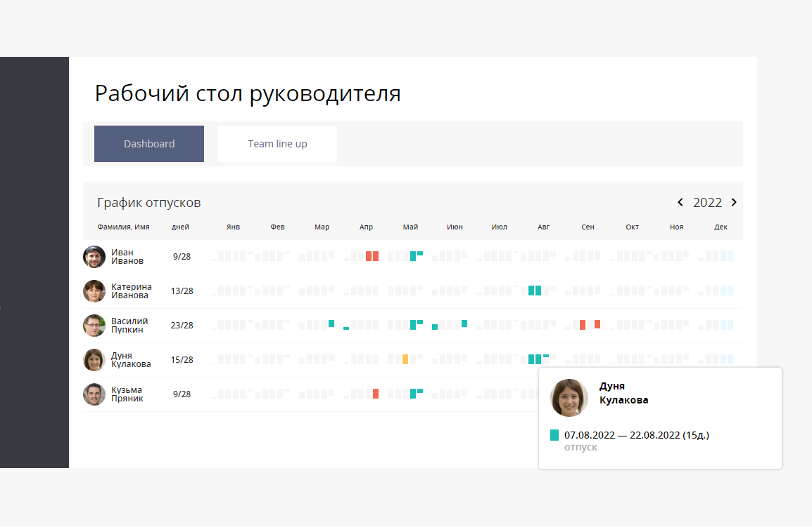
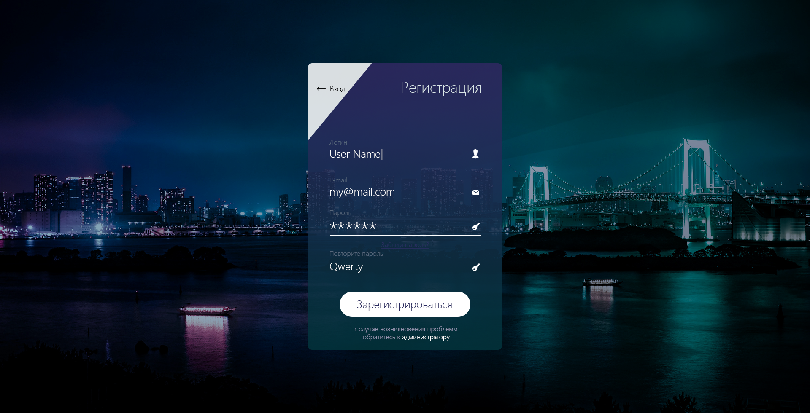

<h2>Hello! My name is Alexey</h2>

I am a fanatical adept of technical creativity, programmer, engineer and researcher, TypeScript stormtrooper in a constant blitzkrieg of self-development on the way to Web Valhalla. 😀

### 📇 Connect with me

  
  

### 🛠 Main languages and Tools

<!-- TypeScript -->

<!-- JavaScript -->

<!-- NodeJS -->

<!-- Express -->

<!-- Koa -->

<!-- Nest -->

<!-- Postgre -->

<!-- MongoDB -->

<!-- Sequelize -->

<!-- Docker -->

<!-- HTML -->

<!-- CSS -->

<!-- React -->

<!-- Redux -->

<!-- Next -->

<!-- Vue -->

<!-- Sass -->

<!-- Less -->

<!-- Firebase -->

<!-- Git -->

<!-- GitLab -->

<!-- Gulp -->

<!-- Webpack -->

<!-- Jest -->

<!-- Figma -->

<!-- Photoshop -->

### 📊 Statistics

 
 

### 🔥 Algorithmic advances

### 💻 Public portfolio

<table>
  <tr>
    <td width='320px'>
          
    </td>
    <td>
      <h3>Timelines Widget</h3>
      
Timeline, Calendar, Single Page Application

      
React, TypeScript, React Router, Gravity UI, Redux Toolkit, React Hook Form, Docker, CI/CD, Unit-tests, Jest

      
NestJS, TypeScript, Domain-driven design (DDD), Hexagonal, SOLID, PostgreSQL, TypeORM, Nginx, Docker, CI/CD, Unit-tests, Jest

      
«Timelines Widget» — web application that helps to analyze the history of work on a ticket. The project is designed to solve the problem of understanding how a ticket changed statuses when certain events occurred.

        <ul>The customer wanted to see the following information on the chart:
          <li>The time an application was in a particular status and the percentage of an application in the status of the total lifetime of the application.</li>
          <li>Clear display of task status changes</li>
          <li>What was the time goal and how long did it take to work on the application</li>
          <li>Change of performers</li>
          <li>Transition to accounting/non-registration holidays</li>
          <li>Targets for visualizing important dates when working on a ticket</li>
        </ul>
    </td>
  </tr>
  <tr>
    <td width='320px'>
      
    </td>
    <td>
      <h3><a href='https://github.com/alvar91/idex-group-react-hooks-typescript-css' title='Open repository'>Idex Group</a></h3>
      
Calendar, Single Page Application, Popover

      
React, TypeScript

      
«Manager's desktop» — widget for Idex Group

    </td>
  </tr>
  <tr>
    <td width='320px'>
      
    </td>
    <td>
      <h3><a href='https://github.com/alvar91/lanproject-js-html-css' title='Open repository'>Lan Project</a></h3>
      
Form, Fake Password Asterisks, Debounce

      
JavaScript, HTML, CSS

      
«Lan Project» — test task for Lan Project

    </td>
  </tr>
  <tr>
    <td width='320px'>
      
    </td>
    <td>
      <h3><a href='https://github.com/alvar91/ozon-tech-hw6-vue-vuex-tsx-vuetify' title='Open repository'>Ozon Messages</a></h3>
      
Virtual Scroll, Single Page Application, Routing, Persistent Storage, Yandex OAuth

      
TypeScript, TSX, Vue, Vue Proxy, Vuex, Vuex Simple, Vue Class Component, Vue Property Decorator, Vue Router, Vuelidate, Vuetify, Vue Notification, VMask, Axios, Swagger Typescript Api

      
«Ozon Messages» — chat rooms with registration and logging

    </td>
  </tr>
  <tr>
    <td width='320px'>
      
    </td>
    <td>
      <h3><a href='https://github.com/alvar91/ozon-tech-hw4-vue-vuex-tsx-tests' title='Open repository'>HR</a></h3>
      
Single Page Application, Routing, Unit testing

      
TypeScript, TSX, Vue, Vuex, Vuex Simple, Vue Class Component, Vue Property Decorator, Vue Router, Jest

      
«HR» — demo of human resource CRM

    </td>
  </tr>
  <tr>
    <td width='320px'>
      
    </td>
    <td>
      <h3><a href='https://github.com/alvar91/shri-2022-react-task3' title='Open repository'>Trello clone</a></h3>
      
Single Page Application, React Hooks, React Patterns, Routing, Persistent storage, Drag and drop

      
React, Redux, Redux Toolkit, Reselect, Redux Persist, React Hook Form, React Router, React Toastify, React Beautiful Dnd

      
«Trello clone» — a demo of the Trello

    </td>
  </tr>
  <tr>
    <td width='320px'>
      
    </td>
    <td>
      <h3><a href='https://github.com/alvar91/instagram-skillbox-diploma-react-hooks-redux-saga-tests' title='Open repository'>Instagram clone</a></h3>
      
Single Page Application, React Hooks, React Patterns, Routing, Unit testing, Integration testing, e2e-testing

      
React, Redux, Redux Saga, React Router, Material UI, Lazyload, Skeleton, Firebase, React Helmet, React Modal, Unsplash API, React Slick Carousel, Jest, Enzyme, Cypress

      
«Instagram clone» — a demo of the Instagram

    </td>
  </tr>
  <tr>
    <td width='320px'>
      
    </td>
    <td>
      <h3><a href='https://github.com/alvar91/coin-scss-js-express' title='Open repository'>Coin.</a></h3>
      
Progressive web app (persistent storage), CRUD, Websocket, Model View Presenter, Patterns, Single Page Application, Routing, Drag and drop, Charts, e2e-tests

      
NodeJS, Express, HTML, SCSS, JavaScript, ChartJS, Cypress, Yandex maps

      
«Coin.» — a demo of the banking system with authorization, logging, work with accounts and user transactions

    </td>
  </tr>
  <tr>
    <td width='320px'>
      
    </td>
    <td>
      <h3><a href='https://github.com/alvar91/crm-skillbox-js-css-express-mongodb' title='Open repository'>Skb CRM</a></h3>
      
CRUD, Model View Presenter, Patterns, Single Page Application, Routing, Pagination

      
NodeJS, Express, MongoDB, Mongoose, HTML, CSS, JavaScript, IMask

      
«Skb CRM» — Customer Relationship Management service for education system

    </td>
  </tr>
  <tr>
    <td width='320px'>
      
    </td>
    <td>
      <h3><a href='https://github.com/alvar91/stdpls-pug-scss-js' title='Open repository'>SitDownPls</a></h3>
      
Responsive, Accessibility, Pixel perfect, Perfomance

      
PUG, SCSS, JavaScript, Yandex maps, Swiper, Input mask, Choices, Nouislider, Progressbar, Gulp, Express, Nodemailer

      
«SitDownPls» — a network of furniture and home accessories stores

    </td>
  </tr>
  <tr>
    <td width='320px'>
      
    </td>
    <td>
      <h3><a href='https://github.com/alvar91/blanchard-html-css-js' title='Open repository'>Blanchard</a></h3>
      
Responsive, Accessibility, Pixel perfect, Perfomance

      
HTML, CSS, JavaScript, JQuery, Yandex maps, Swiper slider, Input mask, Just validate, Popper, Simple bar, Tippy

      
«Blanchard» — a demo of an art Gallery

    </td>
  </tr>
  <tr>
    <td width='320px'>
      
    </td>
    <td>
      <h3><a href='https://github.com/alvar91/evklid-js-html-css' title='Open repository'>Evklid</a></h3>
      
Responsive, Accessibility, Pixel perfect, Perfomance

      
HTML, CSS, JavaScript, JQuery, Swiper slider, Tabs, Gulp

      
«Evklid» — a demo of a project company

    </td>
  </tr>
  <tr>
    <td width='320px'>
      
    </td>
    <td>
      <h3><a href='https://github.com/alvar91/lostshirt-html-css-js' title='Open repository'>Lostshirt</a></h3>
      
HTML, CSS, JavaScript, Slider, Isotope

      
«Lostshirt» — a demo of an online t-shirt store

    </td>
  </tr>
  <tr>
    <td width='320px'>
      
    </td>
    <td>
      <h3><a href='https://github.com/alvar91/lagoona-html-css' title='Open repository'>Lagoona</a></h3>
      
HTML, CSS

      
«Lagoona» — hotel chain

    </td>
  </tr>
</table>
